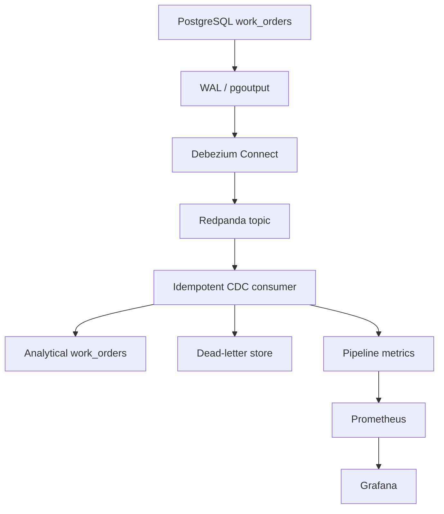

# DC Ops CDC Reliability Platform

A change-data-capture project for propagating maintenance work-order changes from PostgreSQL through Debezium and Kafka-compatible Redpanda into an analytical state store with replay protection and operational metrics.

The repository separates infrastructure configuration from a deterministic CDC consumer core. Unit tests exercise create, update, delete, duplicate, out-of-order, and malformed events without requiring containers.

## What problem this project solves

Reloading an entire operational table whenever a work order changes is slow and wasteful. Change data capture (CDC) reads the database transaction log and emits only inserts, updates, and deletes.

A reliable downstream consumer must also handle:

- Event replay after restarts.
- Duplicate topic offsets.
- Out-of-order source changes.
- Delete propagation.
- Malformed or incompatible envelopes.
- Freshness and failure monitoring.

## CDC basics

- **Write-ahead log (WAL):** PostgreSQL’s ordered record of database changes.
- **Debezium:** converts WAL changes into structured event envelopes.
- **LSN:** PostgreSQL log sequence number used to order source changes.
- **Offset:** a Kafka partition position used to track consumer progress.
- **Upsert:** inserts a new row or updates an existing row by key.
- **Tombstone/delete event:** indicates that source state should be removed downstream.

## Architecture



## Supported Debezium envelope

```json
{
  "op": "u",
  "source": {"lsn": 101},
  "before": {"work_order_id": "wo-1"},
  "after": {
    "work_order_id": "wo-1",
    "equipment_id": "AHU-1",
    "status": "CLOSED",
    "priority": "HIGH",
    "updated_at": "2026-08-31T18:00:00Z"
  }
}
```

Supported operations:

| Code | Meaning | Consumer action |
|---|---|---|
| `c` | Create | Upsert the `after` record |
| `r` | Snapshot read | Upsert the `after` record |
| `u` | Update | Upsert only when the LSN is newer |
| `d` | Delete | Delete the key found in `before` |

## Reliability controls

### Offset idempotency

The tuple `(topic, partition, offset)` is stored in `processed_offsets`. A repeated tuple returns `duplicate` and does not reapply the event.

### Source ordering

Every analytical work-order row stores `source_lsn`. An update is applied only when its LSN is greater than the stored LSN, preventing stale events from overwriting newer state.

### Dead-letter handling

Malformed JSON, missing envelope fields, unsupported operations, and incomplete work-order records are stored with their topic, partition, offset, payload, and failure reason.

### Metrics

The consumer exposes Prometheus text for:

- `dcops_cdc_events_applied_total`
- `dcops_cdc_duplicates_total`
- `dcops_cdc_failures_total`
- `dcops_cdc_freshness_lag_seconds`

## Repository structure

```text
.
├── src/dcops_cdc/
│   └── consumer.py                     # CDC application and metrics logic
├── tests/                               # CRUD, replay, ordering, and DLQ tests
├── debezium/
│   └── postgres-connector.json.template # Runtime-rendered connector config
├── prometheus/prometheus.yml
├── docker-compose.yml                   # PostgreSQL, Redpanda, Connect, metrics UI
├── .github/workflows/
└── pyproject.toml
```

## Test the consumer core

Requirements: Python 3.11 or newer.

```bash
python -m venv .venv
source .venv/bin/activate
python -m pip install -e '.[dev]'
ruff check src tests
pytest -q
```

The tests verify:

- Create, update, and delete propagation.
- Duplicate-offset replay protection.
- LSN protection against stale updates.
- Dead-letter routing for malformed JSON.
- Failure and freshness metric output.

## Start the infrastructure

Requirements: Docker with Compose support and `envsubst`.

Set a local password at runtime:

```bash
export POSTGRES_PASSWORD='choose-a-local-development-password'
docker compose up -d
docker compose ps
```

Register the Debezium connector without writing the password to a repository file:

```bash
envsubst < debezium/postgres-connector.json.template |
  curl -X POST -H 'Content-Type: application/json' \
    --data-binary @- http://localhost:8083/connectors
```

The connector watches `public.work_orders` using PostgreSQL’s `pgoutput` logical-decoding plugin.

Local services:

| Service | Address |
|---|---|
| PostgreSQL | `localhost:5432` |
| Debezium Connect | `localhost:8083` |
| Prometheus | `http://localhost:9090` |
| Grafana | `http://localhost:3000` |

## Processing transaction

For one CDC event, the consumer:

1. Checks whether the topic/partition/offset was already processed.
2. Parses the envelope and validates the operation.
3. Applies an upsert or delete.
4. Uses the source LSN to reject stale overwrites.
5. Records the processed offset.
6. Increments the appropriate pipeline metric.
7. Commits the state and offset together.

## Design decisions

- **WAL-based CDC:** avoids repeated full-table extraction.
- **Offset ledger:** gives replay-safe effects independent of consumer restarts.
- **LSN guard:** protects analytical state from out-of-order events.
- **Runtime credential injection:** keeps passwords out of version control.
- **SQLite consumer core:** makes state transitions fast and deterministic in unit tests.
- **Prometheus text format:** exposes reliability signals using a standard monitoring interface.

## Current boundaries

- Docker Compose starts the infrastructure but does not package the Python consumer as a service.
- The SQLite implementation demonstrates state semantics rather than multi-consumer concurrency.
- Schema evolution is handled as validation failure rather than a compatibility registry.
- Prometheus is configured for a future `consumer:8000` service; the current core returns metrics text but does not start an HTTP server.
- Recovery from a DLQ requires an operator-driven replay process.

## Possible extensions

- Add a Kafka consumer service with manual offset commits.
- Package the metrics endpoint and consumer into Docker Compose.
- Persist analytical state in PostgreSQL.
- Add a schema registry and compatibility policy.
- Add consumer-lag metrics from the broker.
- Add DLQ replay tooling and a documented recovery runbook.
- Add integration tests covering PostgreSQL through Debezium to the sink.

## License

MIT
